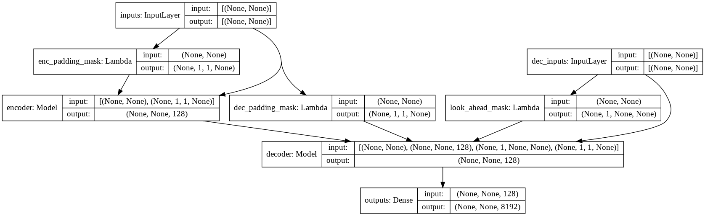

### Setup
- create new anaconda environment and initialize environment `chatbot`
    ```
    conda create -n chatbot python=3.8
    conda activate chatbot
    ```
- run installation script
    ```
    sh setup.sh
    ```
### Model

- check [model.py](transformer/model.py) for the implementation of Multi-Headed Attention, Positional Encoding and Transformer.

### Run
- check all available flags and hyper-parameters `python main.py --help`
```
python train.py --output_dir runs/save_model --batch_size 256 --epochs 50 --max_samples 50000
```
- the final trained model will be saved to `runs/save_model`.


